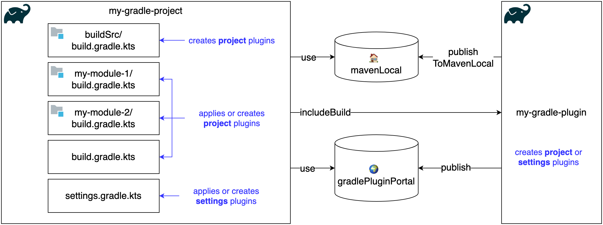

[](https://github.com/rogervinas/gradle-plugins-first-steps/actions/workflows/gradle.yml)

# First Steps Developing Custom Gradle Plugins

Not long ago **Gradle** scared me a lot 👻 ... maybe it was because of [Groovy](https://groovy-lang.org/) who knows ...

But today I am complete in ❤️ with **Gradle**! Please don't tell [Maven](https://maven.apache.org/) 😜

In this demo I will implement basic **Gradle** plugins following the [Developing Custom Gradle Plugins](https://docs.gradle.org/current/userguide/custom_plugins.html) documentation, It will be fun I promise!

**Gradle** plugins allows us to reuse build logic across different projects, and we can implement them in any JVM compatible language: **Java**, **Kotlin**, **Groovy**, ...

## Step by step

Let's follow these steps:

1. [Create plugins directly in the build script](#build-script)
2. [Create plugins in the **buildSrc** module](#buildsrc-project)
3. [Create plugins in a standalone project](#standalone-project)



### Build Script

### BuildSrc Project

### Standalone Project

## Run this demo

### Run my-gradle-project using includeBuild

1. Edit [my-gradle-project/settings.gradle.kts](my-gradle-project/settings.gradle.kts) and:
* Remove or comment line `mavenLocal()` in pluginManagement > repositories
* Add or uncomment line `includeBuild("../my-gradle-plugins")`

2. Execute:
```shell
cd my-gradle-project
./gradlew hello
```

### Run my-gradle-project using mavenLocal

1. Build and publish my-gradle-plugins locally:

```shell
cd my-gradle-plugins
./gradlew publishToMavenLocal
```

2. Edit [my-gradle-project/settings.gradle.kts](my-gradle-project/settings.gradle.kts) and:
* Add or uncomment line `mavenLocal()` in pluginManagement > repositories
* Remove or comment line `includeBuild("../my-gradle-plugins")`

3. Execute:
```shell
cd my-gradle-project
./gradlew hello
```

## Documentation

* [Developing Custom Gradle Plugins](https://docs.gradle.org/current/userguide/custom_plugins.html)
* [Testing Gradle plugins](https://docs.gradle.org/current/userguide/testing_gradle_plugins.html)
